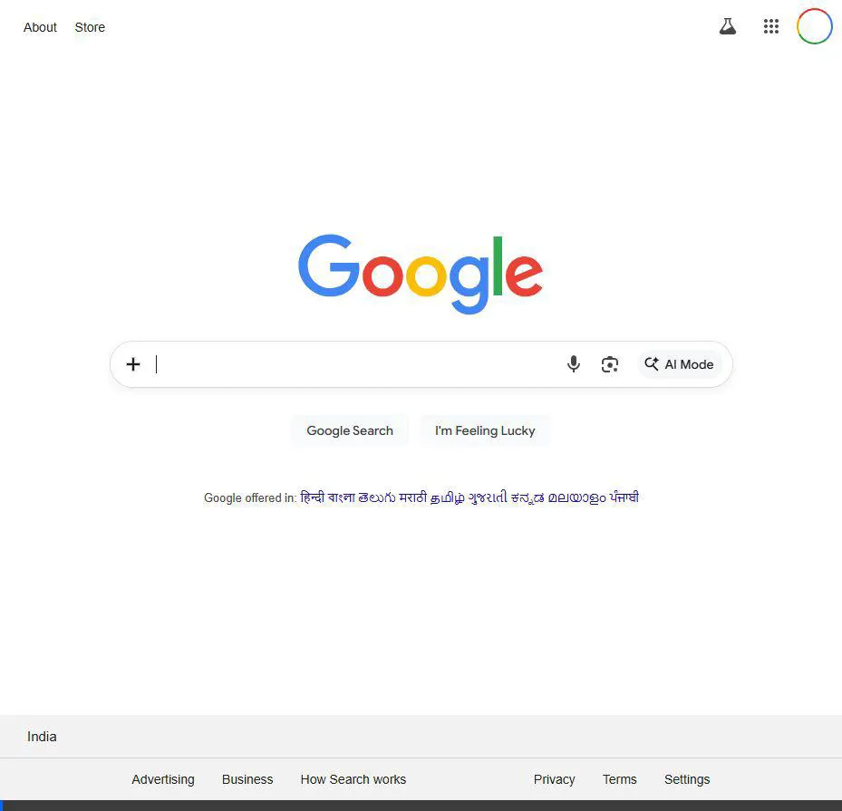
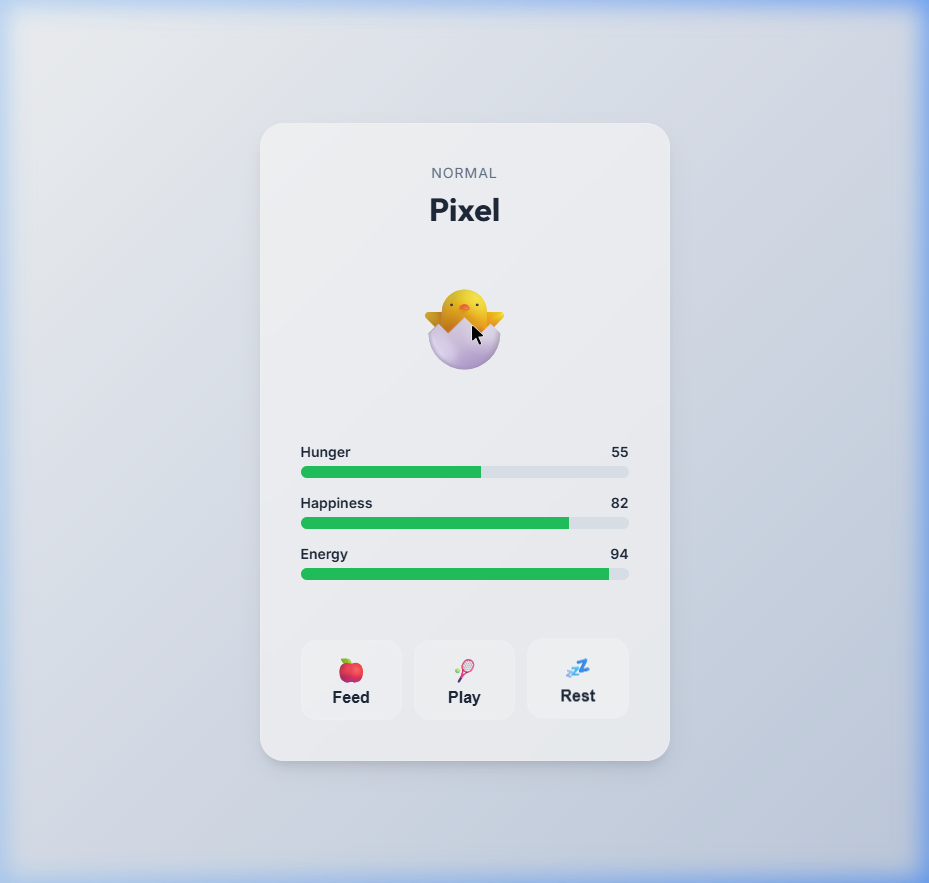

# Tiny Tamagotchi - Spec-Driven MVP

A premium digital pet experience built with Vanilla JS, following the Spec-Driven Development (SDD) methodology.

## 📁 Documentation
All technical specifications, feature plans, and validation strategies are located in the [**documentation/**](./documentation) folder.

- [Mission & Specs](./documentation/specs/mission.md)
- [Living Vitals](./documentation/living-vitals/feature-plan.md)
- [Care Loop](./documentation/care-loop/feature-plan.md)
- [Dynamic States](./documentation/dynamic-states/feature-plan.md)
- [Personal Touches](./documentation/personal-touches/feature-plan.md)

## 🎥 Demonstration
### Video Walkthrough

### Dashboard Screenshot

## 🚀 Getting Started
1. Clone the repository.
2. Open `index.html` in any modern browser.
3. Run logic tests with `node tests/run-tests.js`.
